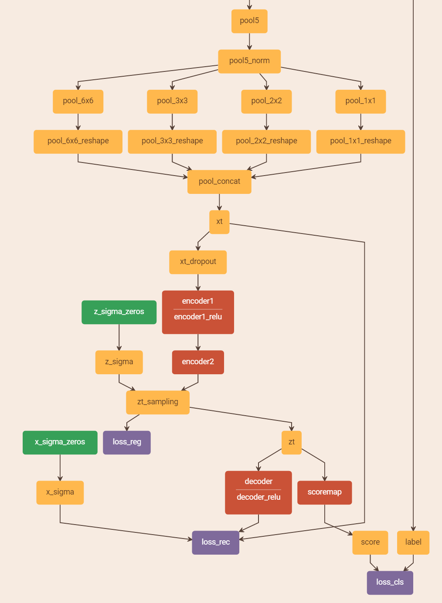

# Fisher Vector encoding with Variational Auto-Encoder (FV-VAE)
This repository holds the code and models for FV-VAE. The code contains (1) training network .prototxt; (2) matlab warpper for FV-VAE extraction; (3) examples of single image/frame sequence FV-VAE extraction (with default VGG19 on UCF101). The code in this repository needs 3rd dependencies:
- caffe (https://github.com/BVLC/caffe)
- Matlab (testing on Matlab 2015b)

# Contents
* [Get the code](#get-the-code-back-to-top)
* [Run single image extraction on matlab](#run-single-image-extraction-on-matlab-back-to-top)
  * [Get VGG19 pre-trained model](#get-vgg19-pre-trained-model-back-to-top)
  * [Set FV-VAE parameters](#set-fv-vae-parameters-back-to-top)
  * [Set image path](#set-image-path-back-to-top)
  * [Extract raw FV-VAE](#extract-raw-fv-vae-back-to-top)
  * [Normalize FV-VAE](#normalize-fv-vae-back-to-top)
* [Run frame sequence extraction on matlab](#run-frame-sequence-extraction-on-matlab-back-to-top)
* [Training/extracting FV-VAE end-to-end](#trainingextracting-fv-vae-end-to-end-back-to-top)
  
----
## Get the code [[back to top](#fisher-vector-encoding-with-variational-auto-encoder-fv-vae)]
Use git to clone this repository and its submodules
```
git clone --recursive https://github.com/fv-vae/fv-vae
```

## Run single image extraction on matlab [[back to top](#fisher-vector-encoding-with-variational-auto-encoder-fv-vae)]

### Get VGG19 pre-trained model [[back to top](#fisher-vector-encoding-with-variational-auto-encoder-fv-vae)]
Download pre-trained VGG19 model, and put into ./pretrained-models/. Or run ./pretrained-modelsget_vgg19_pretrained_model.sh. Or using commond in folder ./pretrained-models
```
wget http://www.robots.ox.ac.uk/~vgg/software/very_deep/caffe/VGG_ILSVRC_19_layers.caffemodel
```

### Set FV-VAE parameters [[back to top](#fisher-vector-encoding-with-variational-auto-encoder-fv-vae)]
Open "extract_fv_vae_single_image.m" using matlab, set (1) extractor network prototxt path; (2) extractor network model path; (3) vae weights path; (4) caffe/matlab folder (IMPORTANT); (5) runnning gpu device id (-1 for cpu).
```
fv_vae_opt.network_deploy_prototxt = './pretrained_models/vgg19_deploy.prototxt';
fv_vae_opt.network_weights = './pretrained_models/VGG_ILSVRC_19_layers.caffemodel';
fv_vae_opt.caffe_vae_weights = './vae_models/caffe_vae_weights_ucf101_split1_vgg19.mat';
fv_vae_opt.caffe_matlab_path = './caffe/matlab'; % change to your caffe matlab folder
fv_vae_opt.device = 0;
```
For vae weights, we give 3 vae weights optimized using caffe in ./vae_models, which are trained on UCF101 3 splits, respectively. The corressponding FV-VAE performance on UCF101 is (10x crop)

	UCF101|split1|split2|split3|average
	:---:|:---:|:---:|:---:|:---:
	Accuracy|83.55%|83.77%|84.57%|83.96%
  
### Set image path [[back to top](#fisher-vector-encoding-with-variational-auto-encoder-fv-vae)]
Set input image path in "extract_fv_vae_single_image.m"
```
image_path = './example_images/000001.jpg';
```

### Extract raw FV-VAE [[back to top](#fisher-vector-encoding-with-variational-auto-encoder-fv-vae)]
Run "extract_fv_vae_single_image.m", and raw FV-VAE (without normalization) will be saved in variable "raw_fv".

### Normalize FV-VAE [[back to top](#fisher-vector-encoding-with-variational-auto-encoder-fv-vae)]
After extract raw_fv on all image in a dataset, run function "normalize_raw_fv.m" to get final FV-VAE. The input/output format see in "normalize_raw_fv.m".

## Run frame sequence extraction on matlab [[back to top](#fisher-vector-encoding-with-variational-auto-encoder-fv-vae)]
For frame sequence, the video-level FV-VAE can be regarded as avarge pooling through all frames. The video-level FV-VAE can be achieved by pooling the results of "extract_fv_vae_single_image.m", or simply run "extract_fv_vae_frame_sequence.m". For "extract_fv_vae_frame_sequence.m", (1) [Get VGG19 pre-trained model](#get-vgg19-pre-trained-model-back-to-top); (2) [Set FV-VAE parameters](#set-fv-vae-parameters-back-to-top); (3) set frame sequence path in "extract_fv_vae_frame_sequence.m"
```
frame_path = {'./example_images/000001.jpg'; './example_images/000002.jpg';
    './example_images/000003.jpg';  './example_images/000004.jpg';
    './example_images/000005.jpg';  './example_images/000006.jpg';
    './example_images/000007.jpg';  './example_images/000008.jpg';
    './example_images/000009.jpg';  './example_images/000010.jpg'};
```
(4) [Extract raw FV-VAE](#extract-raw-fv-vae-back-to-top); (5) [Normalize FV-VAE](#normalize-fv-vae-back-to-top).

# Training/extracting FV-VAE end-to-end [[back to top](#fisher-vector-encoding-with-variational-auto-encoder-fv-vae)]
The end-to-end training/extracting FV-VAE need our modified version of caffe, which will be released in our future plan. Here we give the training prototxt in ./training_prototxt/dq_ucf101_frame_vgg19_split1.prototxt, and also give the visualization of VAE part:



Please note that in this prototxt, "Normalize", "SampleLoss" and "GaussionLoss" are custom layers, which make the prototxt cannot be run using original caffe. The detailed training/extracting settings will be released with our custom caffe.
